# AppCasal — Calendário Pessoal

Aplicação web (e app Android) de calendário pessoal para casais: eventos compartilhados, controle financeiro, hábitos, tarefas, humor, watchlist e muito mais, tudo em um só lugar.

## 🔗 Acesse o app

**[https://app-casal-puce.vercel.app/login](https://app-casal-puce.vercel.app/login)**

## 🧪 Conta de teste

Quer só dar uma olhada sem mexer nos dados reais? Use a conta de teste, que fica isolada em um espaço próprio e não interfere em nada:

| Campo | Valor |
|---|---|
| Usuário | `Teste` |
| Senha | `Teste@123` |

> O login é feito por **nome de usuário**, não por e-mail. Fique à vontade para criar eventos, lançar despesas, marcar hábitos, etc. — nada ali afeta os dados reais.

## 📸 Screenshots

<table>
  <tr>
    <td align="center">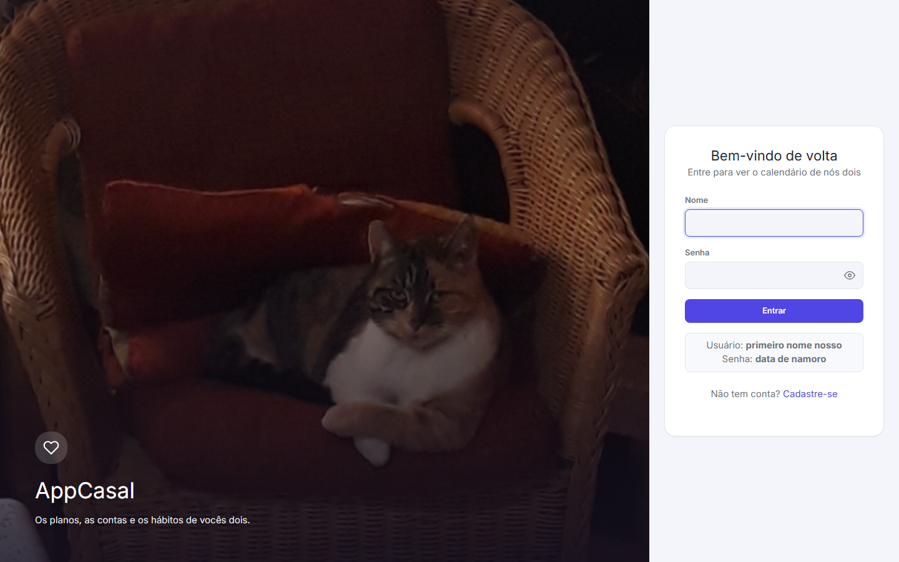<br/><sub><b>Login</b></sub></td>
    <td align="center">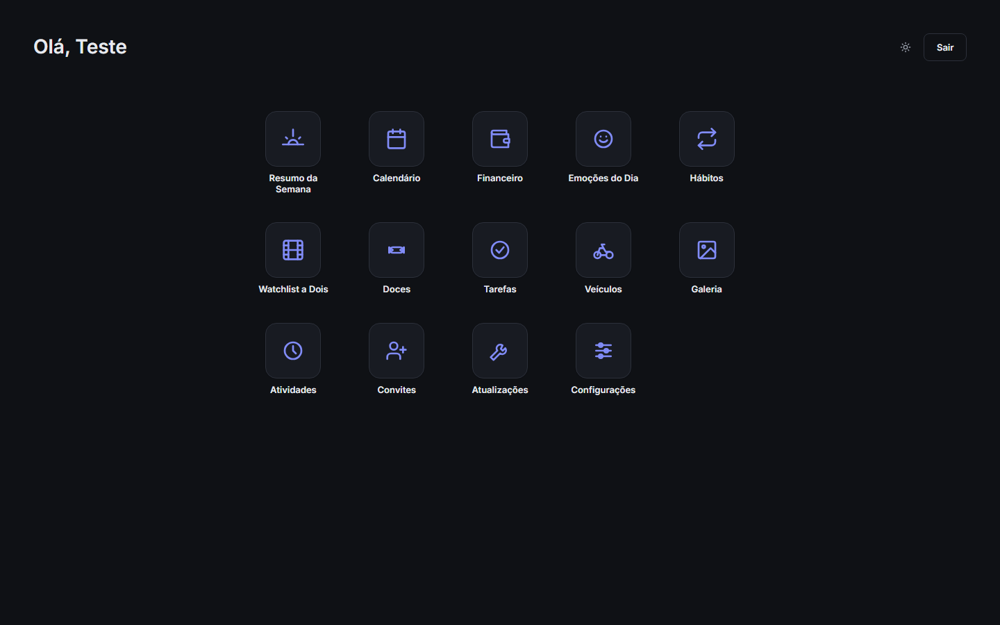<br/><sub><b>Lobby</b></sub></td>
  </tr>
  <tr>
    <td align="center">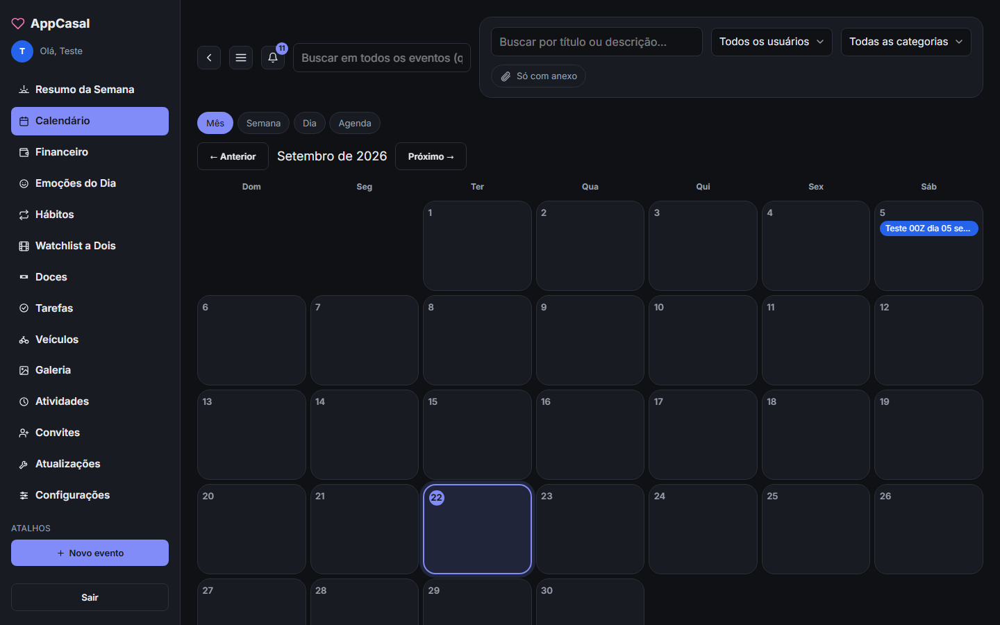<br/><sub><b>Calendário</b></sub></td>
    <td align="center">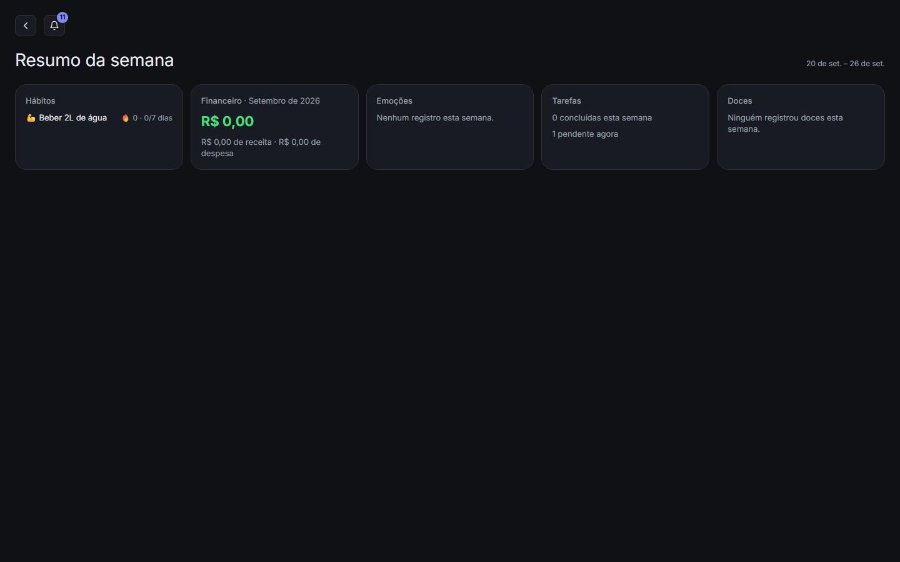<br/><sub><b>Resumo da Semana</b></sub></td>
  </tr>
  <tr>
    <td align="center">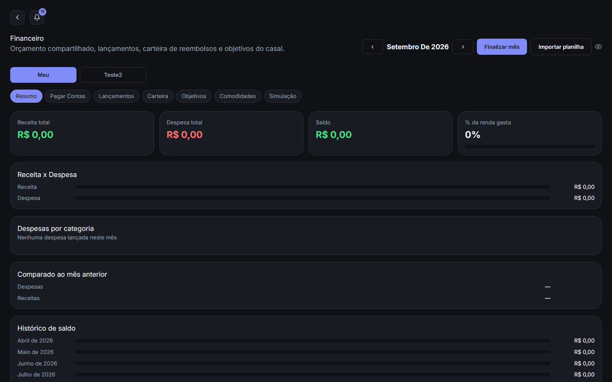<br/><sub><b>Financeiro</b></sub></td>
    <td align="center">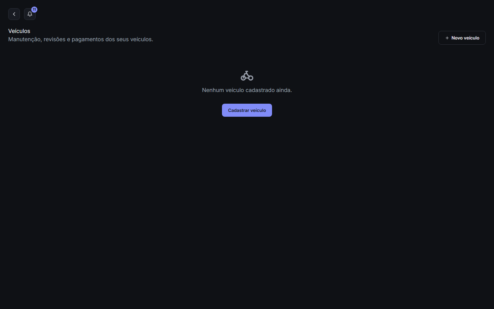<br/><sub><b>Veículos</b></sub></td>
  </tr>
  <tr>
    <td align="center">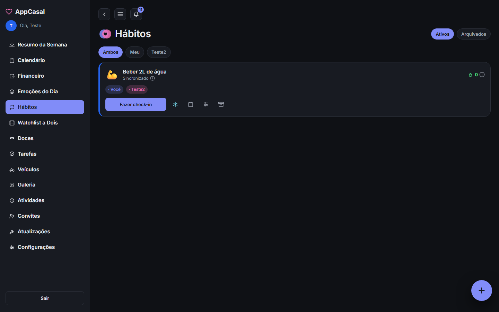<br/><sub><b>Hábitos</b></sub></td>
    <td align="center">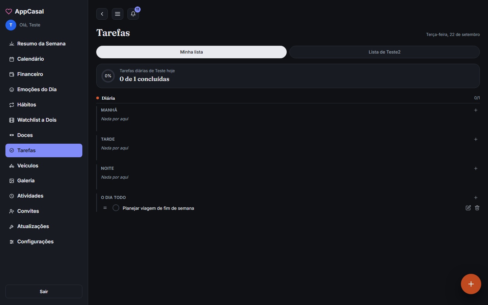<br/><sub><b>Tarefas</b></sub></td>
  </tr>
  <tr>
    <td align="center">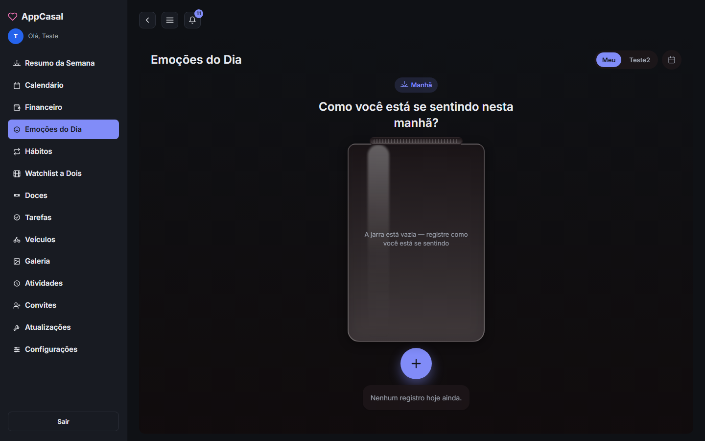<br/><sub><b>Emoções do Dia</b></sub></td>
    <td align="center">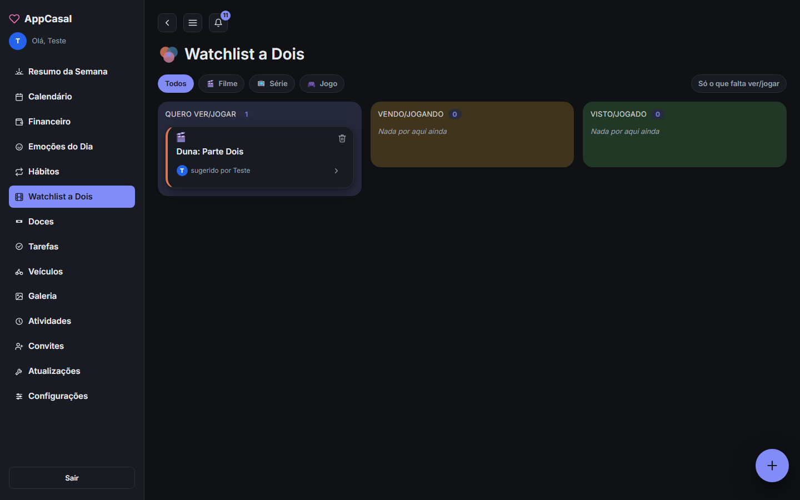<br/><sub><b>Watchlist a Dois</b></sub></td>
  </tr>
  <tr>
    <td align="center">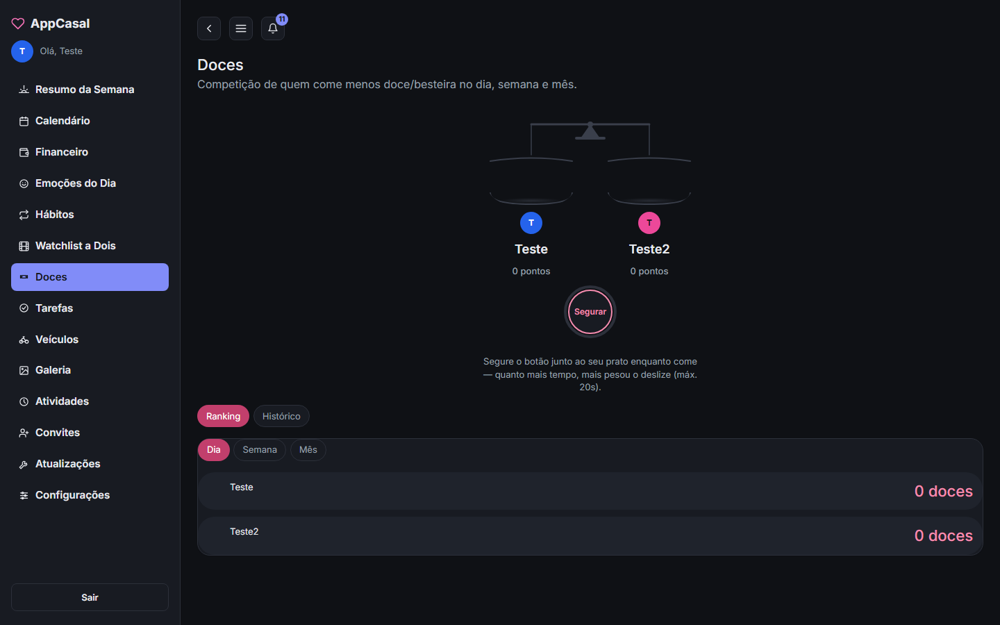<br/><sub><b>Doces</b></sub></td>
    <td align="center">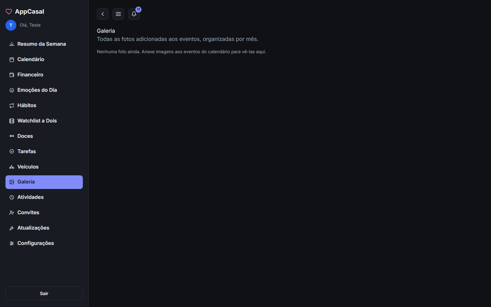<br/><sub><b>Galeria</b></sub></td>
  </tr>
  <tr>
    <td align="center">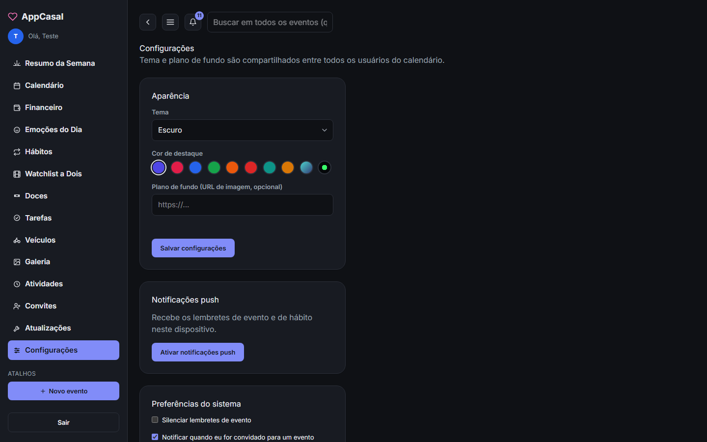<br/><sub><b>Configurações</b></sub></td>
    <td></td>
  </tr>
</table>

### 📱 No celular

<p align="center">
  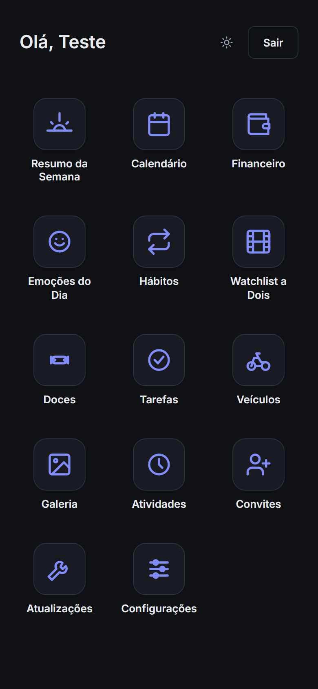
  &nbsp;&nbsp;
  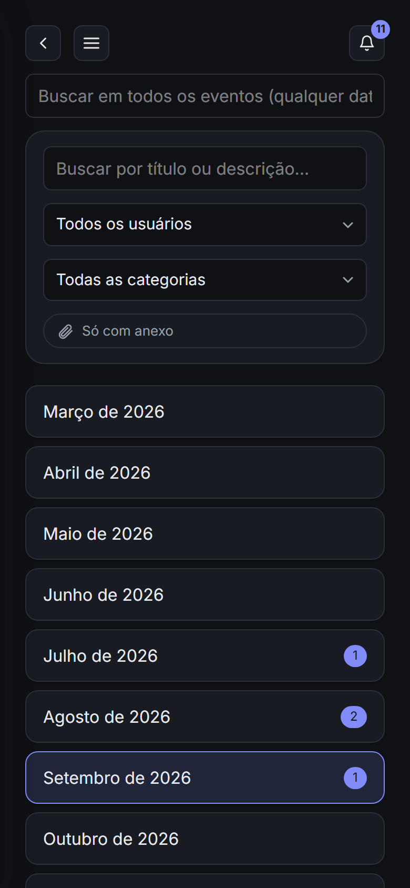
</p>

> Os prints são da conta de teste, então alguns módulos aparecem vazios.

## ✨ Funcionalidades

- **Calendário e eventos** — criação, edição, anexos (fotos/arquivos via Cloudinary)
- **Resumo da Semana** — visão consolidada da semana do casal
- **Financeiro** — orçamento compartilhado, lançamentos, *Pagar Contas*, carteira de reembolsos, objetivos, comodidades, simulações, importação de planilha e fechamento de mês
- **Hábitos** — streak, check-in com foto, hábitos em conjunto, congelamento, reações e histórico
- **Tarefas** — sub-listas por período, arrastar estilo kanban (inclusive no toque) e reset diário
- **Emoções do Dia** — registro diário de emoções com motivos
- **Watchlist** — filmes, séries e jogos (busca de capas via TMDB/RAWG)
- **Doces** — registro de consumo com ranking e "balança da justiça" (funcionalidade lúdica do casal)
- **Veículos** — cadastro com foto, odômetro, manutenção recorrente com checklist e controle de pagamentos
- **Galeria** — fotos compartilhadas
- **Convites** — convite de parceiro(a) para o mesmo espaço (team)
- **Log de atividades** — histórico do que foi feito no app
- **Solicitações de atualização** — pedidos de mudança com geração de título/descrição via IA (Gemini)
- **Notificações push** — Web Push e Firebase Cloud Messaging (app Android)
- **Tema claro/escuro** — com paletas de cor configuráveis
- **App Android** — empacotado com Capacitor, com suporte ao botão físico de voltar

## 🛠️ Stack técnica

- **Backend:** Node.js + Express 5, MongoDB/Mongoose, JWT + bcrypt, Multer + Cloudinary
- **Frontend:** React 19 + Vite + Tailwind CSS v4
- **Mobile:** Capacitor (Android)
- **Testes:** Jest (backend) + Vitest (frontend)
- **Deploy:** Vercel (frontend estático + backend como Serverless Functions)

## 🚀 Como rodar localmente

### Pré-requisitos
- Node.js
- Uma instância MongoDB (local ou Atlas)

### Backend

```bash
cd calendario-web/backend
npm install
cp .env.example .env   # preencher MONGO_URI, JWT_SECRET, credenciais Cloudinary, etc.
npm run dev
```

Sobe em `http://localhost:3000`.

### Frontend

```bash
cd calendario-web/frontend
npm install
npm run dev
```

Sobe em `http://localhost:5500`, com as chamadas `/api` redirecionadas automaticamente para `http://localhost:3000`.

Em produção (Vercel), o frontend é servido como site estático e o backend roda como Serverless Functions sob `/api/*` — não é necessário rodar os dois separadamente nem o backend servir o build do frontend.

### Popular o banco com dados de exemplo

```bash
cd calendario-web/backend
npm run seed
```

Cria as contas do casal, a conta de teste (`Teste`/`Teste@123`), categorias financeiras padrão e alguns eventos de exemplo.

## ⚙️ Variáveis de ambiente (backend)

Copie `calendario-web/backend/.env.example` para `.env` e preencha:

| Variável | Para quê serve |
|---|---|
| `PORT` | Porta do servidor Express em dev local (padrão 3000; não usada na Vercel) |
| `MONGO_URI` | String de conexão do MongoDB |
| `JWT_SECRET` | Chave secreta para assinar os tokens JWT |
| `CLOUDINARY_CLOUD_NAME` / `CLOUDINARY_API_KEY` / `CLOUDINARY_API_SECRET` | Armazenamento de fotos/anexos dos eventos |
| `VAPID_PUBLIC_KEY` / `VAPID_PRIVATE_KEY` / `VAPID_CONTACT_EMAIL` | Web Push (lembretes de evento/hábito no navegador) |
| `GEMINI_API_KEY` | Geração de título/descrição em "Pedir atualização" |
| `TMDB_API_KEY` | Busca de capas de filmes/séries na Watchlist |
| `RAWG_API_KEY` | Busca de capas de jogos na Watchlist |
| `FCM_SERVICE_ACCOUNT_JSON` | Push notifications nativas no app Android (Capacitor) |
| `CRON_SECRET` | Autentica as chamadas aos endpoints `/api/cron/*` (ver [Deploy e cron jobs](#-deploy-e-cron-jobs)) |

## ☁️ Deploy e cron jobs

O app roda inteiro na Vercel: o frontend (build do Vite) é servido como site estático e o backend vira Serverless Functions sob `/api/*` (ver `vercel.json` e `api/index.js` na raiz do repo). O projeto está conectado ao GitHub — todo push na branch `main` dispara um novo deploy.

Como o plano Hobby da Vercel só permite Cron Jobs 1x por dia, as tarefas agendadas do app foram divididas em duas categorias:

- **Diárias** (`vercel.json` → `crons`): lembrete de evento (08:00) e avaliação de streak de hábito + reset de tarefas (00:05), ambas em `America/Sao_Paulo`. A Vercel chama esses endpoints sozinha e se autentica automaticamente via `CRON_SECRET`.
- **A cada minuto** (`/api/cron/habit-reminders`): o lembrete de hábito depende do horário exato configurado em cada hábito, então precisa rodar minuto a minuto — frequência que o Hobby não permite via Vercel Cron. É necessário configurar um serviço externo gratuito, como o [cron-job.org](https://cron-job.org), pra chamar:

  ```
  https://<seu-domínio>.vercel.app/api/cron/habit-reminders?secret=<CRON_SECRET>
  ```

  a cada 1 minuto.

## 📱 Gerando o APK do app Android

O app mobile é um WebView do Capacitor que carrega a URL de produção (`calendario-web/frontend/capacitor.config.json` → `server.url`), então ele já aponta pro app na Vercel — só precisa empacotar.

Não é preciso ter Android Studio/SDK instalado: o workflow `.github/workflows/build-android.yml` builda o frontend, sincroniza o Capacitor e gera o APK de debug direto no GitHub Actions. Pra gerar um novo:

1. Vá em **Actions → build-android** no GitHub.
2. Clique em **Run workflow** (branch `main`).
3. Quando terminar, baixe o artefato `app-casal-debug-apk` — é o `.apk` pronto pra instalar no celular.

Se preferir buildar localmente (precisa de JDK 17+ e Android SDK instalados):

```bash
cd calendario-web/frontend
npm run build
npx cap sync android
cd android
./gradlew assembleDebug   # gera app/build/outputs/apk/debug/app-debug.apk
```

## ✅ Testes

```bash
# Backend (Jest)
cd calendario-web/backend
npm test

# Frontend (Vitest)
cd calendario-web/frontend
npm test
```

## 📁 Estrutura do projeto

```
api/                  # entrypoint serverless (Vercel) — reexporta o app Express e os cron jobs
├── index.js
└── cron/
calendario-web/
├── backend/
│   └── src/
│       ├── config/       # configuração (DB, storage/Cloudinary)
│       ├── controllers/  # lógica das rotas
│       ├── middleware/   # auth, upload
│       ├── models/       # schemas Mongoose
│       ├── routes/       # definição das rotas /api/*
│       └── services/     # lógica auxiliar reutilizável
└── frontend/
    └── src/
        ├── components/   # componentes compartilhados
        ├── context/      # contexto React (auth, etc.)
        ├── features/     # módulos por funcionalidade (calendar, financeiro, habitos, ...)
        ├── hooks/        # hooks customizados
        ├── lib/          # utilitários
        └── services/     # chamadas à API
```
